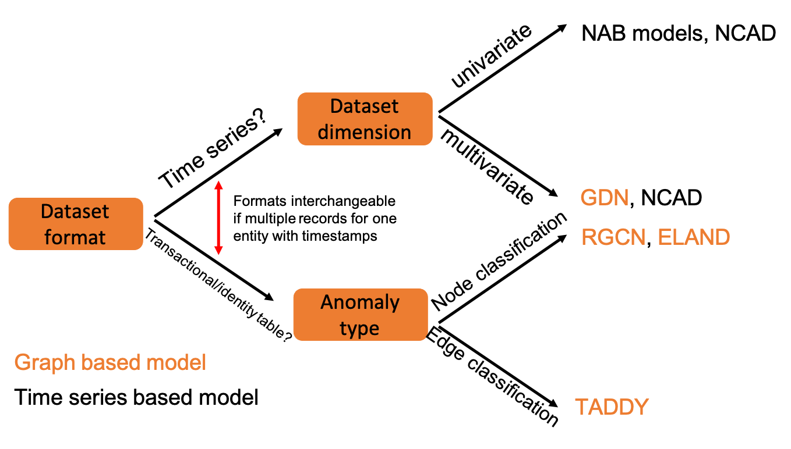
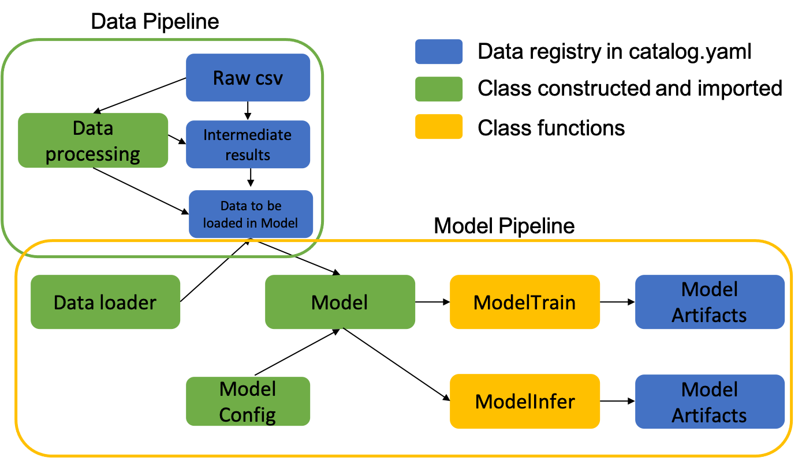

# KDD 2022 Hands-on Tutorial: Anomaly Detection For Spatial Temporal Data

## Overview
This github repo is prepared for KDD 2022 hands-on tutorial. The project pipelines are prepared using the templates from [Kedro](https://kedro.readthedocs.io/en/stable/) 0.18.0. Kedro is an open-source Python framework for creating reproducible, maintainable and modular data science code. It borrows concepts from software engineering and applies them to machine-learning code; applied concepts include modularity, separation of concerns and versioning.  
"Kedro is a development workflow framework which aims to become the industry standard for developing production-ready code. Kedro helps structure your data pipeline using software engineering principles, eliminating project delays due to code rewrites and thereby providing more time to focus on building robust pipelines. Additionally, the framework provides a standardised approach to collaboration for teams building robust, scalable, deployable, reproducible and versioned data pipelines." --QuantumBlack, a McKinsey company

[insert a kedro pipeline visualization here]

## Setting up the environment

We declared dependencies for different pipelines for different use cases and prepared shell script to install the virtual environment. Once the virtual environment is installed, you can run the notebook using the customized env/kernel. Also, user can run the corresponding pipeline after activating the virtual env. 
For example, to run the financial fraud detection pipeline using the TADDY(dynamic graph based) modeling framework, follow these steps below: 
1. Prepare the Kedro Taddy virtual environment 
Run the following command from the repo root directory:

```
cd src
bash prepare_taddy_environment.sh
```

2. Activate the virtual environment
After you install the virtual environment, you should see a folder with the name `kedro-taddy-venv`. 
Activate the virtual environment by running the following command:
```
source kedro-taddy-venv/bin/activate
```
Please change the virtual env name accordingly based on which virtual environment you just installed. 

3. Run the pipeline 
Note that kedro pipeline has to be initiated from the repo root directory. So run the following command: 
```
cd ..
kedro run 
```


## Outline of the Tutorial

## Data Summary
We found and used different datasets for different use cases for this hands-on tutorial to cover enough variations in raw data format and structure. We illustrated different ways to convert the raw data to intermediate data that can be consumed in different modeling framework.  

## Model Summary 

## Mind Map 


## Run the pipelines 


### Instructions on running Kedro pipeline 

You can run the entire pipeline for one use case with the corresponding activated virtual environment:

```
kedro run
```
You can also run your specific Kedro pipeline(sub-pipeline) with:

```
kedro run --pipeline <pipeline_name_in_registry>
```
If you want to run the pipeline with specific tags, you can run: 
```
kedro run --pipeline <pipeline_name_in_registry> --tag <data_tag,model_tag>
```

You can even run your specific Kedro node function in the pipeline(sub-pipeline) with:

```
kedro run --node <node_name_in_registry>
```


For more details, you can run the command:
```
kedro run -h
```
#### For financial fraud use case 


#### For IoT network anomaly use case 


#### For Wifi network anomaly use case


#### For Reddit user behavior use case
### Instructions on running notebooks
You can select the custom kernel after installing the corresponding virtual environment for each use case. For example, to run pipeline under the NCAD modeling framework, you can select the following icon on the instance


#### For financial fraud use case 


#### For IoT network anomaly use case 


#### For Wifi network anomaly use case


#### For Reddit user behavior use case


## References 
1. Subutai Ahmad, Alexander Lavin, Scott Purdy, and Zuha Agha. 2017. Unsupervised real-time anomaly detection for streaming data. 
2. Anisa Allahdadi, Ricardo Morla, and Jaime S. Cardoso. 2018. 802.11 Wireless Simulation and Anomaly Detection using HMM and UBM.
3. Jason Baumgartner, Savvas Zannettou, Brian Keegan, Megan Squire, and Jeremy Blackburn. 2020. The Pushshift Reddit Dataset. 
4. Chris U. Carmona, François-Xavier Aubet, Valentin Flunkert, and Jan Gasthaus. 2021. Neural Contextual Anomaly Detection for Time Series. 
5. Jiho Choi, Taewook Ko, Younhyuk Choi, Hyungho Byun, and Chong-kwon Kim. 2021. Dynamic graph convolutional networks with attention mechanism for rumor detection on social media. 
6. Yuwei Cui, Chetan Surpur, Subutai Ahmad, and Jeff Hawkins. 2016. A comparative study of HTM and other neural network models for online sequence learning with streaming data. 
7. Ailin Deng and Bryan Hooi. 2021. Graph Neural Network-Based Anomaly Detection in Multivariate Time Series.
8. Alexander Lavin and Subutai Ahmad. 2015. Evaluating Real-Time Anomaly Detection Algorithms – The Numenta Anomaly Benchmark. 
9. Yixin Liu, Shirui Pan, Yu Guang Wang, Fei Xiong, Liang Wang, Qingfeng Chen, and Vincent CS Lee. 2015. Anomaly Detection in Dynamic Graphs via Transformer.
10. Edgar Alonso Lopez-Rojas and Stefan Axelsson. 2014. BANKSIM: A BANK PAYMENTS SIMULATOR FOR FRAUD DETECTION RESEARCH.
11. Martin Happ, Matthias Herlich, Christian Maier, Jia Lei Du, and Peter Dorfinger. 2021. Graph-neural-network-based delay estimation for communication networks with heterogeneous scheduling policies. 
12. José Suárez-Varela et. al., The Graph Neural Networking Challenge: A Worldwide Competition for Education in AI/ML for Networks. 
13. Riccardo Taormina et. al.,The Battle Of The Attack Detection Algorithms: Disclosing Cyber Attacks On Water Distribution Networks.
14. Shen Wang and Philip S. Yu. 2022. Graph Neural Networks in Anomaly Detection. In Graph Neural Networks: Foundations, Frontiers, and Applications, Lingfei Wu, Peng Cui, Jian Pei, and Liang Zhao (Eds.). 
15. Yulei Wu, Hong-Ning Dai, and Haina Tang. 2021. Graph Neural Networks for Anomaly Detection in Industrial Internet of Things. 
16. Tong Zhao, Bo Ni, Wenhao Yu, Zhichun Guo, Neil Shah, and Meng Jiang, 2021. Action Sequence Augmentation for Early Graph-based Anomaly De-
tection. 
17. Li Zheng, Zhenpeng Li, Jian Li, Zhao Li, and Jun Gao. 2019. AddGraph: Anomaly Detection in Dynamic Graph Using Attention-based Temporal GCN. 

