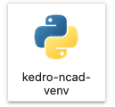

# KDD 2022 Hands-on Tutorial: Anomaly Detection For Spatial Temporal Data

## Overview
This github repo is prepared for KDD 2022 hands-on tutorial. The project pipelines are prepared using the templates with [Kedro](https://kedro.readthedocs.io/en/stable/) 0.18.0. Kedro is an open-source Python framework for creating reproducible, maintainable and modular data science code. It borrows concepts from software engineering and applies them to machine-learning code; applied concepts include modularity, separation of concerns and versioning.  
"Kedro is a development workflow framework which aims to become the industry standard for developing production-ready code. Kedro helps structure your data pipeline using software engineering principles, eliminating project delays due to code rewrites and thereby providing more time to focus on building robust pipelines. Additionally, the framework provides a standardised approach to collaboration for teams building robust, scalable, deployable, reproducible and versioned data pipelines." --QuantumBlack, a McKinsey company

An example of Kedro solution pipeline is shown below. 


If you want to visualize the Kedro pipeline, please follow the instruction [here](https://kedro.readthedocs.io/en/0.18.0/tutorial/visualise_pipeline.html). For this tutorial, we will skip this part. 

## Setting up the environment

We declared dependencies for different pipelines for different use cases and prepared shell script to install the virtual environment. Once the virtual environment is installed, you can run the notebook using the customized env/kernel. Also, user can run the corresponding pipeline after activating the virtual env. 

For example, to run the financial fraud detection pipeline using the TADDY(dynamic graph based) modeling framework, follow these steps below: 
1. Prepare the Kedro Taddy virtual environment 
Run the following command from the repo root directory:

```
cd src
bash prepare_taddy_environment.sh
```

2. Activate the virtual environment
After you install the virtual environment, you should see a folder with the name `kedro-taddy-venv`. 
Activate the virtual environment by running the following command:
```
source kedro-taddy-venv/bin/activate
```
Please change the virtual env name accordingly based on which virtual environment you just installed. 

3. Run the pipeline 
Note that kedro pipeline has to be initiated from the repo root directory. So run the following command: 
```
cd ..
kedro run 
```

4. Repeat the above with `prepare_eland_environment.sh`, `prepare_gdn_environment.sh`, `prepare_nab_environment.sh`, `prepare_ncad_environment.sh`, `prepare_el_environment.sh` to setup all of the required environments.

## Downloading the dataset
We advise to download the datasets before coming to the live session, to have a copy on your local laptop. 

#### For financial fraud use case 
Dataset can be download from [here](https://www.kaggle.com/datasets/ealaxi/banksim1), please download the two csv files (bs140513_032310.csv and bsNET140513_032310.csv) and put them under : `data/01_raw/financial_fraud`

#### For IoT network anomaly use case 
The IoT dataset is source from the [BATADAL website](http://www.batadal.net/data.html) and is placed under `data/01_raw/iot`. This is done by the notebooks [notebooks/download_data.ipynb](notebooks/download_data.ipynb) and [notebooks/industrial_iot/1.0-nk-batadal-exploration.ipynb](notebooks/industrial_iot/1.0-nk-batadal-exploration.ipynb). Please be sure to run one of these notebooks to obtain the dataset.

#### For Wifi network anomaly use case

#### For Reddit user behavior use case
For more details, please refer to [notebooks/download_data.ipynb](notebooks/download_data.ipynb)

## Outline of the Tutorial

I. Introduction of authors and welcome to KDD [5 mins]
II. Overview [10 mins]
 - Overview of use-cases
   - Telecom
   - Consumer behavior
   - Financial
   - IoT
 - Overview of algorithms
   - NAB
   - NCAD
   - Eland
   - GDN
   - Taddy
 - Mindmap 
   - Determine the right modeling framework for your data and anomaly type
 - Overview of code repository
 
III. AWS Account and Environment Setup [20 mins]
IV. In depth detail of algorithms [20 mins]
 - NAB
 - NCAD
 - Eland
 - GDN
 - Taddy
 
V. Hands-on [2 hours]
 - Downloading data sets
 - Setting up local environments
 - Training models using Kedro pipelines
 - Training models using Jupyter Notebooks

 
VI. Conclusion and Take-away [5 mins]

### Instructions on running Kedro pipeline 
First activate the virtual environment for the specific use case:

```
source src/<name_of_use_case>/bin/activate
```

You can run the entire pipeline for one use case with the corresponding activated virtual environment:
```
# make sure you are in the root directory
kedro run
```
You can also run your specific Kedro pipeline(sub-pipeline) with:

```
kedro run --pipeline <pipeline_name_in_registry>
```
If you want to run the pipeline with specific tags, you can run: 
```
kedro run --pipeline <pipeline_name_in_registry> --tag <data_tag,model_tag>
```
You can even run your specific Kedro node function in the pipeline(sub-pipeline) with:

```
kedro run --node <node_name_in_registry>
```
For more details, you can run the command:
```
kedro run -h
```

#### For financial fraud use case 
You can run NAB and TADDY modeling framework for the financial fraud use case. For NAB, time series of amount spent for each unique (customer, category) pair is constructed. For TADDY, a dynamic interaction graph between customer and merchant is built. Each edge represents a transaction record between the customer and merchant.

To do this, follow the below steps, replace `<model>` with one of `nab`, `taddy`
1. Set input dataset to `financial` in `conf/base/parameters.yml`
2. Activate the relevant model virtual env: `source src/kedro-<model>-venv/bin/activate` (you would need to install the virtual env first)
3. Run the pipeline: `kedro run`

#### For IoT network anomaly use case 
You can run NAB, NCAD and GDN modeling framework for the IoT network anomaly use case. To do this, follow the below steps, replace `<model>` with one of `nab`, `ncad`, `gdn`
1. Set input dataset to `iot` in `conf/base/parameters.yml`
2. Activate the relevant model virtual env: `source src/kedro-<model>-venv/bin/activate`
3. Run the pipeline: `kedro run`

#### For Wifi network anomaly use case
You can run NAB and GDN modeling framework for the Wifi network anomaly use case. 
To do this, follow the below steps, replace `<model>` with one of `nab`, `gdn`
1. Set input dataset to `wifi` in `conf/base/parameters.yml`
2. Activate the relevant model virtual env: `source src/kedro-<model>-venv/bin/activate` (you would need to install the virtual env first)
3. Run the pipeline: `kedro run`

#### For Reddit user behavior use case
You can run ELAND modeling framework for the Reddit user behavior anomaly use case. 
To do this, follow the below steps. Since there are only one dataset using ELAND model. You won't need to the change input dataset name in `conf/base/parameters.yml`
1. Activate the ELAND model virtual env: `source src/kedro-eland-venv/bin/activate` (you would need to install the virtual env first)
2. Run the pipeline: `kedro run`

### Instructions on running notebooks
You can select the custom kernel after installing the corresponding virtual environment for each use case. For example, to run pipeline under the NCAD modeling framework, you can select the following icon on the instance



#### For financial fraud use case 
Under *notebooks/financial_fraud*, choose `kedro-taddy-venv` for notebook 1.0, 1.1, 2.1, 3.1. Choose `kedro-nab-venv` for notebook 1.2, 2.2. 

#### For IoT network anomaly use case 
Under *notebooks/industrial_iot*, choose `kedro-gdn-venv` for notebook `*gdn`. Choose `kedro-nab-venv` for notebook `*nab`, and `kedro-ncad-venv`for notebooks `*ncad`. If the environment was set up correctly, the notebook will automatically choose the correct environment.


#### For Wifi network anomaly use case
Under *notebooks/telecom_network*, choose `kedro-gdn-venv` for notebook `*gdn`. If the environment was set up correctly, the notebook will automatically choose the correct environment.

#### For Reddit user behavior use case


## References 
1. Subutai Ahmad, Alexander Lavin, Scott Purdy, and Zuha Agha. 2017. Unsupervised real-time anomaly detection for streaming data. 
2. Anisa Allahdadi, Ricardo Morla, and Jaime S. Cardoso. 2018. 802.11 Wireless Simulation and Anomaly Detection using HMM and UBM.
3. Jason Baumgartner, Savvas Zannettou, Brian Keegan, Megan Squire, and Jeremy Blackburn. 2020. The Pushshift Reddit Dataset. 
4. Chris U. Carmona, François-Xavier Aubet, Valentin Flunkert, and Jan Gasthaus. 2021. Neural Contextual Anomaly Detection for Time Series. 
5. Jiho Choi, Taewook Ko, Younhyuk Choi, Hyungho Byun, and Chong-kwon Kim. 2021. Dynamic graph convolutional networks with attention mechanism for rumor detection on social media. 
6. Yuwei Cui, Chetan Surpur, Subutai Ahmad, and Jeff Hawkins. 2016. A comparative study of HTM and other neural network models for online sequence learning with streaming data. 
7. Ailin Deng and Bryan Hooi. 2021. Graph Neural Network-Based Anomaly Detection in Multivariate Time Series.
8. Alexander Lavin and Subutai Ahmad. 2015. Evaluating Real-Time Anomaly Detection Algorithms – The Numenta Anomaly Benchmark. 
9. Yixin Liu, Shirui Pan, Yu Guang Wang, Fei Xiong, Liang Wang, Qingfeng Chen, and Vincent CS Lee. 2015. Anomaly Detection in Dynamic Graphs via Transformer.
10. Edgar Alonso Lopez-Rojas and Stefan Axelsson. 2014. BANKSIM: A BANK PAYMENTS SIMULATOR FOR FRAUD DETECTION RESEARCH.
11. Martin Happ, Matthias Herlich, Christian Maier, Jia Lei Du, and Peter Dorfinger. 2021. Graph-neural-network-based delay estimation for communication networks with heterogeneous scheduling policies. 
12. José Suárez-Varela et. al., The Graph Neural Networking Challenge: A Worldwide Competition for Education in AI/ML for Networks. 
13. Riccardo Taormina et. al.,The Battle Of The Attack Detection Algorithms: Disclosing Cyber Attacks On Water Distribution Networks.
14. Shen Wang and Philip S. Yu. 2022. Graph Neural Networks in Anomaly Detection. In Graph Neural Networks: Foundations, Frontiers, and Applications, Lingfei Wu, Peng Cui, Jian Pei, and Liang Zhao (Eds.). 
15. Yulei Wu, Hong-Ning Dai, and Haina Tang. 2021. Graph Neural Networks for Anomaly Detection in Industrial Internet of Things. 
16. Tong Zhao, Bo Ni, Wenhao Yu, Zhichun Guo, Neil Shah, and Meng Jiang, 2021. Action Sequence Augmentation for Early Graph-based Anomaly Detection. 
17. Li Zheng, Zhenpeng Li, Jian Li, Zhao Li, and Jun Gao. 2019. AddGraph: Anomaly Detection in Dynamic Graph Using Attention-based Temporal GCN. 

## Trouble shooting 
On Debian/Ubuntu systems, you need to install the python3-venv
package using the following command.
  
    apt-get install python3-venv


## License

This project is licensed under the Apache-2.0 License.
